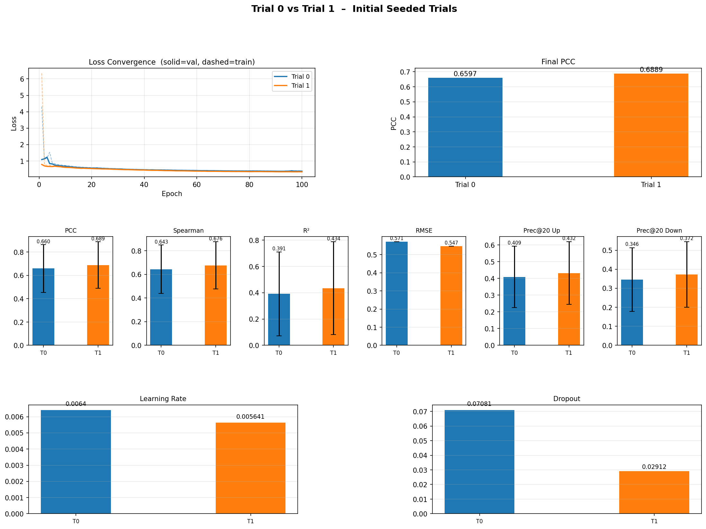

# Sequential Drug Combination Project Progress Report (Perturbation Model Part)
## Investigating LINCS workshop Data
I first tried looking at the data obtained from this [workshop Github](https://github.com/cmap/lincs-workshop-2020/blob/main/notebooks/cell_fitness/Exercise_1_Exploration_of_Prism_Pr500_Cell_Viability_data.ipynb).

I downloaded the data and looked at it manually. 

```bash
 curl -s https://s3.amazonaws.com/repo-assets.clue.io/lincswkshp20_pfc_assets.tgz | tar zx -C .
```

I couldn't find any data that seemed to be related to cell viability, so I will be using the CTRPv2 dataset instead.

## Pre-processing LINCS L1000 and Drug Smiles
### LINCS L1000
Since I need to predict change of expression, I need to pair the post-treatment vs. control LINCS data together as input data, so I'm using the level 3 data similar to SequenTX.

I decided to include dose duration as an additional input. I filtered the drug dosage to be between 9-11 µM similar to the SequenTX paper and chose the top most common durations based on those dosages for the drugs I was interested in, which were 6 hrs and 24 hrs.

When condensing the biological replicates, I was trying to apply characteristic direction (CD) in addition to MODZ (applied by TranSiGen) due to Duan et. al's conclusion that CD can capture a better noise-to-signal ratio compared to MODZ for LINCS data. I tried out the [package created by Clark et. al](http://www.maayanlab.net/CD/), but I wasn't able to get CDs for every compound so decided to stick with only MODZ (the CD package threw errors for a sizable amount of compounds), which is used by TranSiGen during preprocessing.

```
Number of unique cell lines: 70
Unique cell lines:
['A375' 'A549' 'A673' 'AGS' 'ASC' 'BT20' 'CD34' 'CL34' 'CORL23' 'COV644'
 'DV90' 'EFO27' 'FIBRNPC' 'H1299' 'HA1E' 'HCC15' 'HCC515' 'HCT116'
 'HEC108' 'HEK293T' 'HEPG2' 'HL60' 'HS27A' 'HS578T' 'HT115' 'HT29' 'HUH7'
 'JHUEM2' 'JURKAT' 'LOVO' 'MCF10A' 'MCF7' 'MDAMB231' 'MDST8' 'NCIH1694'
 'NCIH1836' 'NCIH2073' 'NCIH508' 'NCIH596' 'NEU' 'NKDBA' 'NOMO1' 'NPC'
 'OV7' 'PC3' 'PHH' 'PL21' 'RKO' 'RMGI' 'RMUGS' 'SKB' 'SKBR3' 'SKLU1'
 'SKM1' 'SKMEL1' 'SKMEL28' 'SNGM' 'SNU1040' 'SNUC4' 'SNUC5' 'SW480'
 'SW620' 'SW948' 'T3M10' 'THP1' 'TYKNU' 'U266' 'U937' 'VCAP' 'WSUDLCL2']
```

### Overall Preprocessing Steps for Perturbation Model (separated into `preprocess_lincs.py`, `preprocess_drugs.py`, and `train_val_test_split.py`):
- Compute Morgan fingerprint from LINCS pert info file for each compound
- Extract expression profiles for the 978 landmark genes in LINCS L1000 filtered by 9-11 µM and 6 or 24 hrs
- Match each perturbation instance with DMSO control instance in same plate
- Apply MODZ to cell line baselines (DMSO replicates) across entire dataset instead of just original plate to collapse into single consensus profile
    - Might give more info/provide more accurate estimate about unperturbed cell state because includes all DMSO replicates for that cell line
    - Done when called with `--cell_line_consensus`
- Apply MODZ to treatment replicates to collapse into single consensus treatment profile
- Create time bin indices for dose durations (same bins used in XPert)
    - Including concentration unecessary for this particular preprocessing since 9-11 µM would fall into the same bin, leading to the concentration input to be constant
- Create quantile-based edges for expression profiles (applying global bin edges similar to XPert but instead of using uniform edges, quantile edges are used since MODZ scores are not necessarily uniformly distributed)
    - Bin edges are computed from a proxy training set defined by holding out 1 of 10 random drug splits (~90% of data), ensuring edges are not influenced by the held-out fold
- Samples randomly shuffled and divided into 5 folds for k-fold cross-validation (warm start)
    - For each test fold, remaining 4 folds form train and validation pool, from which 1/5 of samples are used for validation
    - Splits are sample-level (same drug can appear in train, val, and test)
    - Split = (Morgan drug fingerprint, cell line baseline (raw), cell line baseline (binned), MODZ delta expression (target), time bin idx, cell ids, and drug names)

### Model Input

```
Input = (
    Morgan drug fingerprint,  # (1024,) float32
    cell line baseline binned, # (978,)  int64
    time bin idx,              # scalar  int64
    cell line idx,             # scalar  int64  (auxiliary classification target, not a learned embedding)
    delta expression target    # (978,)  float32
)
```

## Pre-processing CTRPv2 for Cell Viability Regression

CTRPv2 (Cancer Therapeutics Response Portal v2) provides cell viability measurements for perturbed cancer cell lines. This dataset contains the label for the cell viability regression model and needs to be matched with a corresponding change in gene expressions sample from the LINCS L1000 dataset that is of the same duration and approximate concentration.

### Overall Preprocessing Steps for Cell Viability Regression (separated into `preprocess_ctrpv2.py`):
- Load CTRPv2 tables from zip archive and join metadata to get `(ccl_name, broad_cpd_id, cpd_conc_umol, cpd_avg_pv)`
    - Average replicate viability measurements by `(ccl_name, broad_cpd_id, cpd_conc_umol)` and convert concentration to log₁₀ scale
- Filter LINCS instances to those whose cell lines and compounds are present in CTRPv2, excluding DMSO controls
- Apply the same concentration (9–11 µM) and timepoint (6, 24 hrs) filters as the perturbation model
- Match each LINCS instance to the nearest CTRPv2 concentration entry by minimising |log₁₀(LINCS dose) − log₁₀(CTRP dose)|
    - Matches with log₁₀ distance > 0.1 are discarded
- Extract expression profiles for the 978 landmark genes from LINCS Level 3 gctx for treatment instances and all DMSO controls
- Apply MODZ to cell line baselines (DMSO replicates) across entire dataset to collapse into single consensus profile (same as perturbation model)
- Compute delta expression: `delta_expr = treatment_profile − cell_line_baseline`
    - Each matched LINCS instance is kept individually
- Compute drug fingerprints (Morgan 1024-bit) from LINCS pert info SMILES

## Transformer Encoder-Decoder with Cross-Attention

Guo et. al uses a transformer based implementation called XPert for predicting gene expression changes from LINCS 2020 data. It mentioned there is "an unreported limitation of VAE-based models: a lack of robustness in blind tests relative to attention-based approaches. or example, the leading VAE model, TranSiGen, performed well in warm-start tests but its performance deteriorated in cold-cell settings, scoring negative R2 values despite good correlation (Fig. 2b), suggesting a failure to adapt to unseen cellular contexts. We attribute this failure to two intrinsic VAE properties. First, the Kullback–Leibler divergence regularizer forces information compression that can lead to over-denoising, erasing critical cellular context features needed for gene-specific reconstruction. A typical example is the generation of blurry images in image generation by VAEs. Second, VAEs are constrained by their training data, leading to low-fidelity outputs when encountering out-of-distribution samples like unseen cell lines."

This led me to consider incorporating a simplified version of the dual-branch transformer design from XPert. XPert has two outputs: perturbed profile and gene expression changes. Since I'm only interested in gene expression changes, I will only have 1 output head (vs. the 3 in XPert) and am using the same gene expression delta loss function as XPert. According to Guo et. al, "the loss for this task is a combination of m.s.e. and PCC losses. By incorporating the PCC loss, the model is encouraged to not only minimize the absolute differences between predictions and ground truth but also to capture the underlying correlation structure, leading to more accurate and biologically meaningful predictions".

`L = β * MSE(xdeg, x̂deg) + γ * (1 - PCC(xdeg, x̂deg)) + 0.003 * CE(cell_id)`

**β and γ are tunable weighting coefficients (searched via Optuna; best found: β=0.1, γ=1.0). The auxiliary cross-entropy term predicts cell line identity from the CLS token of both encoder branches and is fixed at 0.003.**

XPert credits the pretrained heterogenous graph biological embedding (includes information about drug-target interactions, protein-protein interactions, and drug-drug structural similarity) for its cold-start performance, so I decided to incorporate that as well. I submitted an Academic Downloads license application to DrugBank and am currently waiting on their response. For now, I will not include this, but I plan on retraining once I receive access. XPert also uses UniMol to represent compounds, but I chose Morgan fingerprints for simplicity's sake.

### Model Architecture (Guo et. al)

While XPert could serve as a starting point, I adapted it as a 
transition function for SequenTx-style sequential drug combination 
prediction. The key modifications are: (1) single output head 
predicting only delta expression (xdeg) with Ldeg loss only, removing 
the absolute expression and cell-type classification heads; (2) Morgan 
fingerprint drug representation replacing XPert's UniMol 3D features; and 
(3) MODZ-based preprocessing using cell-line-wide DMSO consensus 
baselines and quantile-based expression binning.

#### Baseline Encoder Branch

"The base encoder captures the unperturbed state of the cell by learning the dependencies between genes within the cell. It utilizes stacked self-attention layers to iteratively process the initial gene expression representation of the unperturbed cell. Given the initial representation, the encoder sequentially applies self-attention blocks across n layers."

#### Perturbation Encoder Branch

"The Pert encoder is responsible for integrating drug molecular features with cellular context through cascaded cross-attention and self-attention layers. The cross-attention module explicitly models gene-level perturbation effects by aligning the multimodal drug representation with cellular-state features. Subsequent self-attention layers refine these interaction patterns and maintain the positional awareness of key regulatory genes.

In the cross-attention layers, the cell representation is treated as the query, and tokenized drug representation serves as the key and value matrix. This allows the model to learn gene-level perturbation effects induced by the drug."

#### Hyperparameter Search

##### Summary of Manual Refinement Decisions

The hyperparameter tuning proceeded in two stages: iterative manual refinement of the training loop followed by automated Bayesian search using Optuna.

The initial training run (sequential fold training, no learning rate scheduler, 500 epochs, patience 50) was cancelled due to Cayuga's job time limit. To speed up the training process, the following measures were implemented:
- FlashAttention via using `scaled_dot_product_attention` in self-attention and cross-attention layers
- Decreased from 10-fold to 5-fold cross-validation
    - Helped with parallelizing fold training since it took up less nodes than 10-fold
- Shortened patience from 50 to 20
    - Initially used 500 epochs similar to paper, but decreased to 200 epochs to stay within the time limit
- Guo et al mentioned for larger datasets would be better to consider larger batch sizes and more attention layers
    - Doubled batch size from 128 to 256
    - Increased learning rate from `4e-3` to `5.6e-3` (chose to experiment between multiplying by sqrt(batch size multiplication factor) and linearly scaling)
    - Also tried training with linearly scaled learning rate `8e-3`
        - Currently still running
- Added learning rate scheduler
    - Linear warmup over 70 epochs (LR increases from `base_lr / warmup_epochs` to `base_lr`) followed by cosine annealing back to zero over the remaining 130 epochs. This schedule was chosen because early epochs with high LR caused erratic validation loss (train loss spiking to >4.0 in trial 0 of the Optuna search at the same LR range), while the gradual warmup allowed stable convergence. The `base_lr` was set to `4e-3`, peaking at approximately `5.6e-3` at epoch 70
    - I realized I messed up after running the base config model because I didn't checkpoint the optimizer and learning rate scheduler states, so that function was added in the CLI as well
- AdamW with `weight_decay=1e-5` and gradient clipping at norm 1.0 used for optimizer
- Using `mse_weight=0.2`, `pcc_weight=1.0` as loss weights similar to Guo et al

##### Optuna Bayesian search

An Optuna study (TPE sampler, seed 42; MedianPruner with 5 warmup steps) was submitted to search over the following variables while holding the fixed parameters constant:

| Parameter | Search range |
|---|---|
| `learning_rate` | Log-uniform in [5.6×10⁻³, 8×10⁻³] |
| `trt_structure` | {`CA+SA+SA+CA`, `CA+SA+SA+SA+CA`} |
| `mse_weight` | {0.1, 0.2, 0.5} |
| `pcc_weight` | {0.5, 1.0, 2.0} |
| `dropout` | Uniform in [0.0, 0.1] |

The search was configured for 20 trials, each trained for up to 100 epochs with patience 10 on fold 0's validation set and evaluated by mean PCC. The initial search was done sequentially and timed out due to Cayuga's time limit. The results are from the sequential search.

| Trial | `learning_rate` | `trt_structure` | `mse_weight` | `pcc_weight` | `dropout` | Val PCC |
|---|---|---|---|---|---|---|
| 0 | 6.40×10⁻³ | `CA+SA+SA+CA` | 0.1 | 1.0 | 0.071 | 0.6597 |
| 1 | 5.64×10⁻³ | `CA+SA+SA+CA` | 0.1 | 1.0 | 0.029 | 0.6889 |



Trial 1 was the best found, suggesting that lower dropout (0.029 vs. 0.071) and a slightly lower peak learning rate improve validation PCC. Both trials preferred `mse_weight=0.1` over the manually chosen 0.2, and both retained the default `CA+SA+SA+CA` perturbation encoder structure. The search did not complete enough trials to draw firm conclusions about `pcc_weight` or `trt_structure`, so the base configuration was used for the full 5-fold evaluation.

A pattern observed from the trials conducted so far include:
- Dropout matters more than expected, less dropout seems to result in better performance
- Log(2) learning rate is marginally better than double learning rate

I made a mistake when implementing the parallel search: I used the above trials as seeds and Optuna did not diversify the trial parameters. As such, I swapped to using 


##### Best Optuna Configuration (`config_optuna_best.json`)

| Category | Parameter | Value |
|---|---|---|
| Dataset | `gene_num` | 978 |
| Dataset | `n_bins` | 128 |
| Dataset | `num_cell_id` | 70 |
| Dataset | `num_pert_time` | 6 |
| Model | `hidden_size` | 256 |
| Model | `n_heads` | 8 |
| Model | `attention_probs_dropout_prob` | 0.0708 |
| Model | `hidden_dropout_prob` | 0.0708 |
| Model | `cell_input_hidden_dropout_prob` | 0.0708 |
| Model | `drug_input_hidden_dropout_prob` | 0.0708 |
| Model | `ctl_structure` | `SA+SA+SA+SA` |
| Model | `trt_structure` | `CA+SA+SA+CA` |
| Training | `learning_rate` | 6.40×10⁻³ |
| Training | `mse_weight` (β) | 0.1 |
| Training | `pcc_weight` (γ) | 1.0 |
| Training | `epochs` | 200 |
| Training | `batch_size` | 256 |
| Training | `patience` | 20 |

### Results For Base Config

| Category | Parameter | Value |
|---|---|---|
| Dataset | `gene_num` | 978 |
| Dataset | `n_bins` | 128 |
| Dataset | `num_cell_id` | 70 |
| Dataset | `num_pert_time` | 6 |
| Model | `hidden_size` | 256 |
| Model | `n_heads` | 8 |
| Model | `attention_probs_dropout_prob` | 0.1 |
| Model | `hidden_dropout_prob` | 0.1 |
| Model | `cell_input_hidden_dropout_prob` | 0.1 |
| Model | `drug_input_hidden_dropout_prob` | 0.1 |
| Model | `ctl_structure` | `SA+SA+SA+SA` |
| Model | `trt_structure` | `CA+SA+SA+CA` |
| Training | `learning_rate` | 5.6×10⁻³ |
| Training | `mse_weight` | 0.2 |
| Training | `pcc_weight` | 1.0 |
| Training | `batch_size` | 256 |
| Training | `epochs` | 200 |
| Training | `patience` | 50 |
| Training | `warmup_epochs` | 70 |
| Training | `weight_decay` | 1×10⁻⁵ |
| Training | `grad_clip_norm` | 1.0 |

All five folds trained to completion (200 epochs) with no early stopping triggered on these parameters. Validation loss decreased relatively smoothly across the folds.


| Fold | PCC (mean ± std) | Spearman (mean ± std) | R² (mean ± std) | RMSE | Prec@20 Up | Prec@20 Down |
|---|---|---|---|---|---|---|
| 0 | 0.6977 ± 0.1932 | 0.6850 ± 0.1938 | 0.4624 ± 0.3277 | 0.5348 | 0.4377 ± 0.1863 | 0.3754 ± 0.1704 |
| 1 | 0.7041 ± 0.1899 | 0.6920 ± 0.1899 | 0.4718 ± 0.3245 | 0.5305 | 0.4414 ± 0.1841 | 0.3817 ± 0.1708 |
| 2 | 0.7006 ± 0.1902 | 0.6885 ± 0.1905 | 0.4642 ± 0.3450 | 0.5294 | 0.4382 ± 0.1846 | 0.3771 ± 0.1712 |
| 3 | 0.7085 ± 0.1894 | 0.6962 ± 0.1900 | 0.4800 ± 0.3222 | 0.5259 | 0.4492 ± 0.1862 | 0.3882 ± 0.1724 |
| 4 | 0.6955 ± 0.1947 | 0.6829 ± 0.1952 | 0.4604 ± 0.3355 | 0.5345 | 0.4326 ± 0.1859 | 0.3741 ± 0.1710 |
| **Mean** | **0.7013 ± 0.0046** | **0.6889 ± 0.0048** | **0.4678 ± 0.0072** | **0.5310 ± 0.0033** | **0.4398 ± 0.0055** | **0.3793 ± 0.0051** |

Cross-validation results (5 folds):
Mean PCC: 0.7013 ± 0.0046
Median PCC: 0.7006
Mean Spearman: 0.6889 ± 0.0048
Median Spearman: 0.6885
Mean R²: 0.4678 ± 0.0072
Median R²: 0.4642
Mean RMSE: 0.5310 ± 0.0033
Median RMSE: 0.5305
Mean Pos P@20: 0.4398 ± 0.0055
Median Pos P@20: 0.4382
Mean Neg P@20: 0.3793 ± 0.0051
Median Neg P@20: 0.3771

### Results For Warm Start

| Fold | PCC (mean ± std) | Spearman (mean ± std) | R² (mean ± std) | RMSE | Prec@20 Up | Prec@20 Down |
|---|---|---|---|---|---|---|
| 0 | 0.7038 ± 0.1929 | 0.6917 ± 0.1933 | 0.4652 ± 0.3253 | 0.5341 | 0.4441 ± 0.1868 | 0.3804 ± 0.1721 |
| 1 | 0.6985 ± 0.1935 | 0.6862 ± 0.1935 | 0.4535 ± 0.3305 | 0.5380 | 0.4377 ± 0.1848 | 0.3762 ± 0.1699 |
| 2 | 0.6871 ± 0.1970 | 0.6736 ± 0.1974 | 0.4200 ± 0.3803 | 0.5465 | 0.4280 ± 0.1853 | 0.3646 ± 0.1702 |
| 3 | 0.7140 ± 0.1884 | 0.7020 ± 0.1882 | 0.4823 ± 0.3214 | 0.5243 | 0.4555 ± 0.1864 | 0.3932 ± 0.1737 |
| 4 | 0.7108 ± 0.1884 | 0.6990 ± 0.1885 | 0.4773 ± 0.3161 | 0.5257 | 0.4489 ± 0.1857 | 0.3904 ± 0.1729 |
| **Mean** | **0.7028 ± 0.0095** | **0.6905 ± 0.0101** | **0.4597 ± 0.0222** | **0.5337 ± 0.0082** | **0.4428 ± 0.0094** | **0.3810 ± 0.0103** |

Cross-validation results (5 folds):
Mean PCC: 0.7028 ± 0.0095
Median PCC: 0.7038
Mean Spearman: 0.6905 ± 0.0101
Median Spearman: 0.6917
Mean R²: 0.4597 ± 0.0222
Median R²: 0.4652
Mean RMSE: 0.5337 ± 0.0082
Median RMSE: 0.5341
Mean Pos P@20: 0.4428 ± 0.0094
Median Pos P@20: 0.4441
Mean Neg P@20: 0.3810 ± 0.0103
Median Neg P@20: 0.3804

### Results For Zero-Shot Cell-Line Generalization

| Fold | PCC (mean ± std) | Spearman (mean ± std) | R² (mean ± std) | RMSE | Prec@20 Up | Prec@20 Down |
|---|---|---|---|---|---|---|
| 0 | 0.0840 ± 0.1829 | 0.0711 ± 0.1732 | -0.1977 ± 0.2480 | 0.7556 | 0.1015 ± 0.0929 | 0.0615 ± 0.0651 |
| 1 | 0.1196 ± 0.2180 | 0.1138 ± 0.2125 | -0.3930 ± 0.5588 | 0.7688 | 0.0955 ± 0.1008 | 0.0753 ± 0.0860 |
| 2 | 0.1187 ± 0.1693 | 0.1110 ± 0.1696 | -0.1378 ± 0.1930 | 0.7507 | 0.0854 ± 0.0694 | 0.0699 ± 0.0582 |
| 3 | 0.1746 ± 0.2998 | 0.1678 ± 0.2960 | -0.0915 ± 0.2603 | 0.8183 | 0.1254 ± 0.1211 | 0.0534 ± 0.0745 |
| 4 | 0.0729 ± 0.1363 | 0.0625 ± 0.1412 | -0.2289 ± 0.3110 | 0.8495 | 0.0627 ± 0.0645 | 0.0370 ± 0.0433 |
| **Mean** | **0.1140 ± 0.0356** | **0.1052 ± 0.0375** | **-0.2098 ± 0.1032** | **0.7886 ± 0.0387** | **0.0941 ± 0.0205** | **0.0594 ± 0.0135** |

Cross-validation results (5 folds):
Mean PCC: 0.1140 ± 0.0356
Median PCC: 0.1187
Mean Spearman: 0.1052 ± 0.0375
Median Spearman: 0.1110
Mean R²: -0.2098 ± 0.1032
Median R²: -0.1977
Mean RMSE: 0.7886 ± 0.0387
Median RMSE: 0.7688
Mean Pos P@20: 0.0941 ± 0.0205
Median Pos P@20: 0.0955
Mean Neg P@20: 0.0594 ± 0.0135
Median Neg P@20: 0.0615

## Cell Viability Regression Models

Two model families were trained to predict cell viability from delta expression profiles: Ridge regression and XGBoost. Both use the same feature matrix (delta expression concatenated with drug fingerprints, or delta expression + duration for gene-only variants).

### Hyperparameters

| Model | Hyperparameters |
|---|---|
| Ridge | `alpha=1.0` |
| XGBoost (grid search) | `n_estimators` ∈ {100, 200, 300}, `max_depth` ∈ {4, 6, 8}, `learning_rate` ∈ {0.1, 0.3, 0.5}, `subsample` ∈ {0.5, 0.7}, `colsample_bytree` ∈ {0.7, 0.9}, `tree_method=hist` |

The grid search evaluates all combinations (3 × 3 × 3 × 2 × 2 = 108 combinations) using 5-fold cross-validation scored by Pearson correlation coefficient. The fixed-run XGBoost uses the default hyperparameters listed above without searching.

### Best XGBoost Hyperparameters (Grid Search Result)

Both the Δexpr + FP and Δexpr + duration variants selected the same best configuration:

| Hyperparameter | Best Value |
|---|---|
| `n_estimators` | 300 |
| `max_depth` | 6 |
| `learning_rate` | 0.1 |
| `subsample` | 0.7 |
| `colsample_bytree` | 0.7 |

Note that `n_estimators=300` is the upper bound of the search range, suggesting performance may improve further with more trees.

## Citations

Chen, X., Deng, Y., Yang, X. et al. Reinforcement learning-based design of sequential drug treatment targeting the evolving tumour landscape with SequenTx. Nat Mach Intell 8, 351–371 (2026). https://doi.org/10.1038/s42256-026-01192-1

Clark, N.R., Hu, K.S., Feldmann, A.S. et al. The characteristic direction: a geometrical approach to identify differentially expressed genes. BMC Bioinformatics 15, 79 (2014). https://doi.org/10.1186/1471-2105-15-79

Duan, Q., Reid, S., Clark, N. et al. L1000CDS2: LINCS L1000 characteristic direction signatures search engine. npj Syst Biol Appl 2, 16015 (2016). https://doi.org/10.1038/npjsba.2016.15

Guo, Y., Zhang, H., Hu, H. et al. Modelling drug-induced cellular perturbation responses with a biologically informed dual-branch transformer. Nat Mach Intell 8, 96–112 (2026). https://doi.org/10.1038/s42256-025-01165-w

Tong, X., Qu, N., Kong, X. et al. Deep representation learning of chemical-induced transcriptional profile for phenotype-based drug discovery. Nat Commun 15, 5378 (2024). https://doi.org/10.1038/s41467-024-49620-3